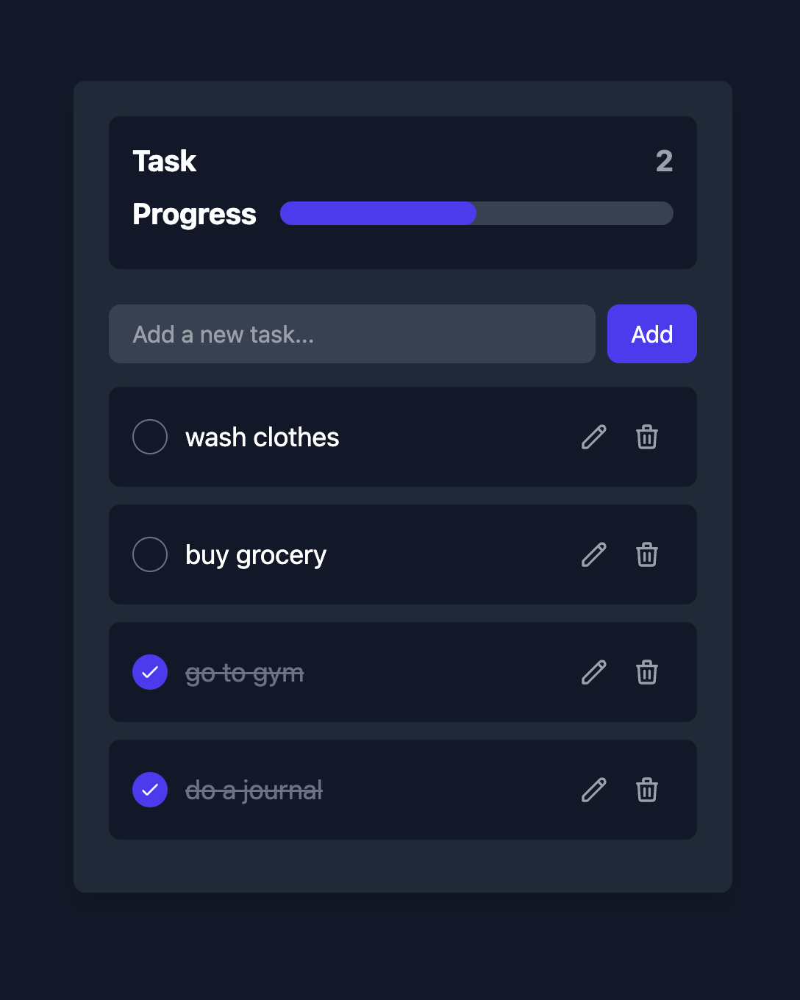

#  Todo List App

## Site Link : https://tstodolistapp.netlify.app/

A simple and elegant **Todo List App** built with **React, TypeScript, Vite, and Tailwind CSS**.  
This app allows users to **add, edit, complete, and delete tasks**, with **local storage support** to persist tasks even after refreshing the page.  

##  Features
-  **Add, Edit, Complete, and Delete Todos**  
-  **Persists Tasks in Local Storage** (Data is saved even after a page refresh)  
-  **Modern UI with Tailwind CSS**  
-  **Fast Performance with Vite**  
-  **Absolute Imports for Cleaner Code** (`@components`, `@utils`, etc.)  
-  **Built with TypeScript for Type Safety**  

## Technologies Used
- **React** (Frontend framework)  
- **TypeScript** (Static typing for better code maintainability)  
- **Vite** (Lightning-fast development and build tool)  
- **Tailwind CSS** (Utility-first CSS framework for styling)  
- **Local Storage API** (To save and load tasks)  

## Project Structure
```
* todo-list-app
├── 📁 src
│   ├── 📁 components
│   │   ├── 📄 TaskForm.tsx
│   │   ├── 📄 TaskItem.tsx
│   │   ├── 📄 ProgressBar.tsx
│   ├── 📁 utils
│   │   ├── 📄 localStorage.ts
│   ├── 📄 App.tsx
│   ├── 📄 main.tsx
│   ├── 📄 interfaces.ts
│   ├── 📄 index.css
├── 📄 tsconfig.json
├── 📄 vite.config.ts
├── 📄 tailwind.config.js
├── 📄 package.json
├── 📄 README.md
```

## Getting Started
### ** Clone the Repository**
```sh
git clone https://github.com/your-username/todo-list.git
cd todo-list
```

### ** Install Dependencies**
```sh
npm install
# or
yarn install
```

### ** Start the Development Server**
```sh
npm run dev
# or
yarn dev
```

### ** Build for Production**
```sh
npm run build
# or
yarn build
```

##  Configuration & Setup
### ** Absolute Imports**
This project uses absolute imports with Vite's alias system.
Defined in `vite.config.ts`:
```ts
resolve: {
  alias: {
    '@components': path.resolve(__dirname, 'src/components'),
    '@utils': path.resolve(__dirname, 'src/utils')
  }
}
```
You can import components like this:
```tsx
import TaskForm from '@components/TaskForm';
import { getTasksFromLocalStorage } from '@utils/localStorage';
```

### ** Local Storage Integration**
Tasks are automatically saved to and loaded from Local Storage, ensuring they persist even after the page is refreshed.

####  Saving Tasks
```ts
export const saveTasksToLocalStorage = (tasks: Task[]): void => {
  localStorage.setItem('tasks', JSON.stringify(tasks));
};
```

####  Retrieving Tasks
```ts
export const getTasksFromLocalStorage = (): Task[] => {
  const storedTasks = localStorage.getItem('tasks');
  return storedTasks ? JSON.parse(storedTasks) : [];
};
```

## UI Preview

